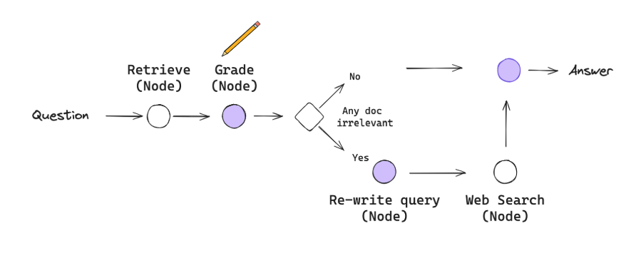
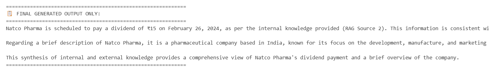

#  Enhanced Corrective Agentic RAG System

A sophisticated Retrieval-Augmented Generation (RAG) system built with LangGraph that implements intelligent document relevancy scoring with a 70% threshold mechanism. The system automatically routes between direct answer generation and web search augmentation based on document relevance scores.



## Output



## Features

### Core Capabilities
- **Intelligent Document Retrieval**: Advanced similarity search using FAISS vector database
- **Smart Relevancy Scoring**: AI-powered document grading with percentage-based scoring
- **Threshold-Based Routing**: 70% relevancy threshold determines workflow path
- **Dynamic Query Rewriting**: Intelligent query enhancement for better retrieval
- **Web Search Integration**: Tavily API integration for external knowledge
- **Multi-Source Information Fusion**: Combines internal knowledge with external web data
- **Comprehensive Analytics**: Detailed execution statistics and workflow tracking

### Workflow Intelligence
```
If Relevancy ≥ 70%: Retrieve → Grade → Generate (Direct Path)
If Relevancy < 70%: Retrieve → Grade → Rewrite → Web Search → Generate (Enhanced Path)
```

## Architecture

### System Components

#### 1. **Retriever Node**
- Performs semantic similarity search against vector database
- Retrieves top-k relevant document chunks
- Supports both original and rewritten queries

#### 2. **Grader/Evaluator Node**
- AI-powered relevancy assessment for each retrieved document
- Calculates percentage-based relevancy scores
- Implements 70% threshold decision logic
- Provides binary classification: "relevant" vs "not relevant"

#### 3. **Query Rewriter Node**
- Enhances original queries for improved retrieval
- Adds synonyms, expands abbreviations
- Clarifies intent and context

#### 4. **Web Search Node**
- Integrates Tavily API for real-time web search
- Converts search results to document format
- Fallback mechanism when API unavailable

#### 5. **Generate Node**
- Synthesizes information from multiple sources
- Combines RAG documents with web search results
- Provides source attribution and analysis summary

### State Management
```python
class CorrectiveRAGState(TypedDict):
    # Input & Output
    question: str
    generation: str
    
    # Document Processing
    documents: List[Document]
    documents_relevant: bool
    grade_scores: List[str]
    relevancy_percentage: float
    threshold_met: bool
    
    # Query Enhancement
    rewritten_question: str
    
    # Web Integration
    web_search_needed: bool
    web_documents: List[Document]
    
    # System Tracking
    current_step: str
    retry_count: int
    messages: Annotated[Sequence[BaseMessage], operator.add]
```

## 🚀 Getting Started

### Prerequisites
- Python 3.8+
- OpenAI API key
- Tavily API key (optional, for web search)

### Installation

1. **Clone the repository**
```bash
git clone <repository-url>
cd agents_assignment
```

2. **Install dependencies**
```bash
pip install -r requirements.txt
```

3. **Set up environment variables**
Create a `.env` file in the root directory:
```bash
OPENAI_API_KEY=your_openai_api_key_here
TAVILY_API_KEY=your_tavily_api_key_here  # Optional
```

4. **Prepare your data**
Place your documents in the `data/` directory. The system currently supports text files.

### Quick Start

1. **Open the Jupyter notebook**
```bash
jupyter notebook notebook/agentic_rag_assignment.ipynb
```

2. **Run the setup cells** to initialize models and load data

3. **Test the system**
```python
# Example usage
result = run_corrective_rag("What is the dividend amount Natco pharma will pay?")

# Extract final answer
final_answer = result.get("generation", "No answer generated")
print(final_answer)
```

## 📁 Project Structure

```
agents_assignment/
├── README.md                              # This file
├── requirements.txt                       # Python dependencies
├── .env                                   # Environment variables (create this)
├── .gitignore                            # Git ignore rules
├── data/
│   └── dividend.txt                      # Sample financial data
└── notebook/
    ├── agentic_rag_assignment.ipynb      # Main implementation
    └── travel_planner_agent.ipynb       # Additional agent example
```

## 🔧 Configuration

### Model Configuration
```python
# OpenAI Models
model = load_model("gpt-4o")                    # Chat model
embedding_model = load_model("text-embedding-3-small")  # Embeddings
```

### Vector Database Settings
```python
# Document chunking
chunk_size = 1000
chunk_overlap = 200

# Retrieval settings
k = 5  # Number of documents to retrieve
```

### Threshold Settings
```python
# Relevancy threshold (configurable)
RELEVANCY_THRESHOLD = 70.0  # 70% threshold for direct generation
```

## 🎮 Usage Examples

### Basic Query Processing
```python
# High relevancy query (likely to meet 70% threshold)
result = run_corrective_rag("What is the dividend yield information for companies?")

# Low relevancy query (likely to trigger web search)
result = run_corrective_rag("What are the latest market trends in AI technology?")
```

### Extracting Results
```python
# Extract only the final answer
if result:
    final_answer = result.get("generation", "No answer generated")
    print("📋 FINAL ANSWER:")
    print(final_answer)
    
    # System statistics
    print(f"📊 Relevancy: {result.get('relevancy_percentage', 0.0):.1f}%")
    print(f"🎯 Threshold Met: {result.get('threshold_met', False)}")
    print(f"🌐 Web Search Used: {'Yes' if result.get('web_documents') else 'No'}")
```

### Workflow Path Analysis
```python
# Check which path was taken
if result.get('threshold_met', False):
    print("✅ Direct Path: High relevancy documents found")
else:
    print("🔄 Enhanced Path: Web search augmentation used")
```

## 📊 System Analytics

The system provides comprehensive analytics for each query:

- **📈 Relevancy Percentage**: Percentage of relevant documents found
- **🎯 Threshold Status**: Whether 70% threshold was met
- **📚 Document Count**: Number of documents retrieved and used
- **🌐 Web Search Usage**: Whether external search was performed
- **🔄 Query Rewrites**: Number of query enhancement attempts
- **📋 Workflow Path**: Which execution path was taken


